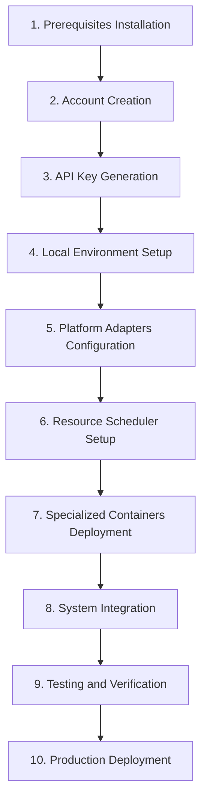

# AGENT-CONTROL: Complete Setup Guide

## Overview

This guide provides step-by-step instructions for setting up the Federated AI System, including account creation, platform configuration, API key management, and system deployment. Follow these instructions sequentially to ensure proper setup and avoid configuration errors.

## Setup Roadmap



## 1. Prerequisites Installation

### Required Software

```bash
# Install Python 3.11+ (if not already installed)
# For Ubuntu/Debian
sudo apt update
sudo apt install python3.11 python3.11-venv python3.11-dev

# For macOS (using Homebrew)
brew install python@3.11

# For Windows
# Download from https://www.python.org/downloads/

# Install Node.js and npm (for frontend)
# For Ubuntu/Debian
curl -fsSL https://deb.nodesource.com/setup_18.x | sudo -E bash -
sudo apt install -y nodejs

# For macOS
brew install node@18

# For Windows
# Download from https://nodejs.org/en/download/

# Install Docker (for containers)
# Follow instructions at https://docs.docker.com/get-docker/
```

### Clone Repository

```bash
# Clone the repository
git clone https://github.com/yourusername/federated-ai-system.git
cd federated-ai-system

# Create and activate virtual environment
python -m venv venv
# On Linux/macOS
source venv/bin/activate
# On Windows
# venv\Scripts\activate

# Install Python dependencies
pip install -r requirements.txt

# Install frontend dependencies
cd frontend
npm install
cd ..
```

## 2. Account Creation

### Google Colab

1. Go to [Google Colab](https://colab.research.google.com/)
2. Sign in with your Google account (create one if needed)
3. Verify GPU access:
   - Click on "Runtime" > "Change runtime type"
   - Set "Hardware accelerator" to "GPU"
   - Click "Save"
4. Create a new notebook for testing:
   - Run `!nvidia-smi` to verify GPU access
   - If successful, you'll see GPU information

### Kaggle

1. Go to [Kaggle](https://www.kaggle.com/)
2. Sign up for an account
3. Verify account via email
4. Enable GPU access:
   - Go to "Account" > "Settings"
   - Scroll to "API" section
   - Click "Create New API Token" (save the kaggle.json file)
5. Test GPU access:
   - Create a new notebook
   - Set accelerator to "GPU P100"
   - Run `!nvidia-smi` to verify

### HuggingFace

1. Go to [HuggingFace](https://huggingface.co/)
2. Sign up for an account
3. Verify account via email
4. Create an API token:
   - Go to "Settings" > "Access Tokens"
   - Create a new token with "write" access
   - Copy and save the token securely

### GitPod

1. Go to [GitPod](https://www.gitpod.io/)
2. Sign up using GitHub, GitLab, or Bitbucket
3. Verify account via email
4. Set up workspace:
   - Go to "Workspaces"
   - Create a new workspace from your repository
   - Select appropriate resources

### Replit

1. Go to [Replit](https://replit.com/)
2. Sign up for an account
3. Verify account via email
4. Create a new Repl:
   - Select "Python" template
   - Name your Repl
   - Click "Create Repl"

### Intel DevCloud (Optional)

1. Go to [Intel DevCloud](https://devcloud.intel.com/oneapi/)
2. Sign up for an account (academic email preferred)
3. Complete the registration form
4. Wait for approval email (usually within 24 hours)
5. Follow the instructions in the approval email to access the platform

## 3. API Key Generation

### OpenRouter API

1. Go to [OpenRouter](https://openrouter.ai/)
2. Sign up for an account
3. Navigate to API Keys section
4. Create a new API key
5. Copy and save the key securely

### Groq API

1. Go to [Groq](https://console.groq.com/)
2. Sign up for an account
3. Navigate to API Keys section
4. Create a new API key
5. Copy and save the key securely

### Cloudflare (Optional)

1. Go to [Cloudflare](https://dash.cloudflare.com/sign-up)
2. Sign up for an account
3. Add a site or create a Pages project
4. Navigate to "API Tokens"
5. Create a new API token with appropriate permissions
6. Copy and save the token securely

### Supabase (Optional)

1. Go to [Supabase](https://supabase.com/)
2. Sign up for an account
3. Create a new project
4. Navigate to "Project Settings" > "API"
5. Copy the URL and anon key
6. Save these credentials securely

## 4. Local Environment Setup

### API Key Management

Create a secure environment file to store your API keys:

```bash
# Create .env file
touch .env

# Edit the file with your favorite editor
# Add your API keys in the following format:
# OPENROUTER_API_KEY=your_key_here
# GROQ_API_KEY=your_key_here
# HUGGINGFACE_TOKEN=your_token_here
# SUPABASE_URL=your_url_here
# SUPABASE_KEY=your_key_here
```

For enhanced security, use a credential manager:

```python
# Run the credential manager setup
python scripts/setup_credentials.py

# Follow the prompts to securely store your credentials
# This will encrypt your API keys and store them safely
```

### Database Setup

If using Supabase:

```bash
# Initialize Supabase schema
python scripts/init_supabase.py

# This will create the necessary tables and indexes
```

If using local SQLite:

```bash
# Initialize local database
python scripts/init_local_db.py

# This will create the SQLite database with required schema
```

## 5. Platform Adapters Configuration

### Colab Adapter Setup

```bash
# Configure Colab adapter
python scripts/configure_adapter.py --platform colab

# Follow the prompts to:
# 1. Enter your Google account credentials
# 2. Configure anti-timeout settings
# 3. Set up Google Drive integration (optional)
# 4. Configure resource preferences
```

### Kaggle Adapter Setup

```bash
# Configure Kaggle adapter
python scripts/configure_adapter.py --platform kaggle

# Follow the prompts to:
# 1. Upload your kaggle.json file
# 2. Configure dataset access
# 3. Set up resource preferences
```

### GitPod Adapter Setup

```bash
# Configure GitPod adapter
python scripts/configure_adapter.py --platform gitpod

# Follow the prompts to:
# 1. Enter your GitPod token
# 2. Configure workspace settings
# 3. Set up resource preferences
```

### HuggingFace Adapter Setup

```bash
# Configure HuggingFace adapter
python scripts/configure_adapter.py --platform huggingface

# Follow the prompts to:
# 1. Enter your HuggingFace token
# 2. Configure model access
# 3. Set up Spaces integration
```

## 6. Resource Scheduler Setup

```bash
# Configure Resource Scheduler
python scripts/configure_scheduler.py

# Follow the prompts to:
# 1. Set priority levels for different platforms
# 2. Configure queue management settings
# 3. Set up failure recovery options
# 4. Configure resource optimization preferences
```

Test the scheduler:

```bash
# Run scheduler test
python scripts/test_scheduler.py

# This will simulate task submission and verify proper allocation
```

## 7. Specialized Containers Deployment

### Chat Container (Dolphin 3.0 R1)

```bash
# Build and deploy Chat Container
cd containers/chat_container
docker build -t federated-ai/chat-container .
docker run -d -p 8000:8000 --env-file ../../.env federated-ai/chat-container

# Verify deployment
curl http://localhost:8000/health
```

### Development Container

```bash
# Build and deploy Development Container
cd containers/dev_container
docker build -t federated-ai/dev-container .
docker run -d -p 8001:8000 --env-file ../../.env federated-ai/dev-container

# Verify deployment
curl http://localhost:8001/health
```

### Media Container (ComfyUI)

```bash
# Build and deploy Media Container
cd containers/media_container
docker build -t federated-ai/media-container .
docker run -d -p 8188:8188 --gpus all federated-ai/media-container

# Verify deployment
curl http://localhost:8188/
```

## 8. System Integration

### Frontend Deployment

```bash
# Build and deploy frontend
cd frontend
npm run build

# Deploy to GitHub Pages
npm run deploy

# Or deploy to Cloudflare Pages
npx wrangler pages publish dist
```

### Backend Deployment

```bash
# Deploy backend to Replit
cd backend
# Follow Replit deployment instructions in backend/DEPLOY.md

# Or deploy locally
uvicorn main:app --host 0.0.0.0 --port 8080
```

### Integration Testing

```bash
# Run integration tests
python scripts/integration_test.py

# This will verify that all components are working together correctly
```

## 9. Testing and Verification

### System Health Check

```bash
# Run system health check
python scripts/health_check.py

# This will verify all components are operational
```

### Performance Testing

```bash
# Run performance tests
python scripts/performance_test.py

# This will benchmark the system's performance
```

### Security Verification

```bash
# Run security checks
python scripts/security_check.py

# This will verify that credentials are properly secured
```

## 10. Production Deployment

### Final Configuration

```bash
# Generate production configuration
python scripts/generate_prod_config.py

# This will create optimized configuration files for production
```

### Deployment

```bash
# Deploy the complete system
python scripts/deploy.py

# This will deploy all components to their respective platforms
```

### Monitoring Setup

```bash
# Set up monitoring
python scripts/setup_monitoring.py

# This will configure monitoring and alerts
```

## Platform-Specific Guides

### Google Colab Optimization

For maximum performance on Google Colab:

1. Use the provided notebook templates in `notebooks/colab/`
2. Run the GPU optimization script:
   ```python
   # In your Colab notebook
   !wget -q https://raw.githubusercontent.com/yourusername/federated-ai-system/main/scripts/colab_optimize.py
   %run colab_optimize.py
   ```
3. Connect to Google Drive for persistent storage:
   ```python
   from google.colab import drive
   drive.mount('/content/drive')
   ```
4. Use the anti-timeout script:
   ```python
   # In your Colab notebook
   !wget -q https://raw.githubusercontent.com/yourusername/federated-ai-system/main/scripts/colab_keeper.py
   %run colab_keeper.py
   ```

### Kaggle Optimization

For maximum performance on Kaggle:

1. Use the provided notebook templates in `notebooks/kaggle/`
2. Enable internet access in notebook settings
3. Run the GPU optimization script:
   ```python
   # In your Kaggle notebook
   !wget -q https://raw.githubusercontent.com/yourusername/federated-ai-system/main/scripts/kaggle_optimize.py
   %run kaggle_optimize.py
   ```
4. Use the Kaggle API for automation:
   ```python
   import kaggle
   # API commands here
   ```

### HuggingFace Spaces Deployment

For deploying to HuggingFace Spaces:

1. Create a new Space on HuggingFace
2. Select "Docker" as the Space type
3. Link your GitHub repository
4. Configure the Space to use the Dockerfile in `containers/media_container/`
5. Set the required environment variables in the Space settings

### GitPod Workspace Setup

For optimal GitPod configuration:

1. Add the `.gitpod.yml` file from `configs/gitpod/` to your repository
2. Configure prebuilds for faster startup
3. Use the workspace optimization script:
   ```bash
   bash scripts/gitpod_optimize.sh
   ```

## Troubleshooting

### Common Issues

#### Google Colab Disconnections

If experiencing frequent disconnections:

1. Check that the anti-timeout script is running
2. Reduce memory usage in your notebooks
3. Try reconnecting at different times of day
4. Use the provided reconnection script:
   ```python
   %run scripts/colab_reconnect.py
   ```

#### API Rate Limiting

If encountering API rate limits:

1. Implement the API rotation system:
   ```python
   from utils.api_rotation import APIRotator
   rotator = APIRotator()
   api_key = rotator.get_next_key("openai")
   ```
2. Add more API keys to your rotation pool
3. Implement exponential backoff for retries

#### GPU Memory Issues

If running out of GPU memory:

1. Use the memory optimization techniques:
   ```python
   from utils.memory_optimization import optimize_memory
   optimize_memory()
   ```
2. Reduce batch sizes in your models
3. Implement gradient checkpointing
4. Use mixed precision training

## Advanced Configuration

### Custom Platform Adapters

To create adapters for additional platforms:

1. Use the adapter template in `templates/platform_adapter.py`
2. Implement the required methods for your platform
3. Register the adapter in the Resource Scheduler:
   ```python
   from adapters.your_adapter import YourAdapter
   from core.resource_scheduler import ResourceScheduler
   
   scheduler = ResourceScheduler()
   scheduler.register_adapter("your_platform", YourAdapter)
   ```

### Custom Container Deployment

To create additional specialized containers:

1. Use the container template in `templates/container/`
2. Modify the Dockerfile and code for your needs
3. Build and deploy following the pattern in section 7

### Advanced Security Configuration

For enhanced security:

1. Use the security hardening script:
   ```bash
   python scripts/security_harden.py
   ```
2. Implement key rotation:
   ```bash
   python scripts/rotate_keys.py --period 7d
   ```
3. Set up IP restrictions for API access

## Maintenance and Updates

### Regular Maintenance

Perform these tasks regularly:

1. Update dependencies:
   ```bash
   pip install -r requirements.txt --upgrade
   cd frontend && npm update && cd ..
   ```
2. Rotate API keys:
   ```bash
   python scripts/rotate_keys.py
   ```
3. Check for platform changes:
   ```bash
   python scripts/platform_check.py
   ```

### System Updates

When updating the system:

1. Pull the latest changes:
   ```bash
   git pull
   ```
2. Run the update script:
   ```bash
   python scripts/update_system.py
   ```
3. Verify the update:
   ```bash
   python scripts/verify_update.py
   ```

## Conclusion

You have now set up the complete Federated AI System with all its components. The system is ready to leverage free cloud resources across multiple platforms for AI computing tasks.

For additional help or to report issues, please refer to the project's GitHub repository or contact the maintainers.

Remember to regularly check for updates and security advisories to keep your system running optimally and securely.
