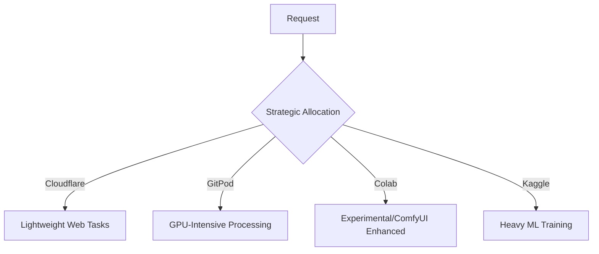

# CONTROL-AGENCY Architecture

## System Overview
Federated AI system now leveraging revised resource providers with infinite GPU maximization strategy:


## Core Updates

### Enhanced Resource Allocation


### Credential Capture System
```tsx
interface CredentialPayload {
  provider: 'GitPod' | 'Colab' | 'Kaggle' | 'Cloudflare';
  username: string;
  password: string; // Encrypted at rest
  apiKeys: {
    [key: string]: string;
  };
  sessionToken?: string;
}

const captureCredentials = (chatInput: string): CredentialPayload => {
  // Regex patterns for credential extraction
  const patterns = {
    username: /username[:=]\s*([^\s]+)/i,
    password: /password[:=]\s*([^\s]+)/i,
    apiKey: /(api[-_]?key)[:=]\s*([a-z0-9]{32,})/gi
  };
  // ... extraction logic
};
```

### GPU Maximization Tactics
1. **Colab GPU Burner**:
```python
def maximize_colab():
    while True:
        try:
            # Use multiple parallel sessions
            with concurrent.futures.ThreadPoolExecutor() as executor:
                futures = [executor.submit(train_model) for _ in range(4)]
        except Exception:
            # Automatically reconnect
            refresh_session()
```

2. **Kaggle Ultra Expansion**:
```python
def kaggle_max_util():
    import os
    os.environ['TF_GPU_THREAD_MODE'] = 'gpu_private'
    os.environ['TF_USE_CUDNN_BATCHNORM_SPATIAL_PERSISTENT'] = '1'
    # Force maximum GPU allocation
```

## Interface Updates
```tsx
function CredentialForm() {
  return (
    <div className="absolute bottom-0 right-0 w-96 p-4 bg-gray-900/90">
      <h3 className="text-white font-bold">Provider Credentials</h3>
      <textarea 
        className="w-full h-32 mt-2 p-2 text-sm"
        placeholder="Paste your credentials/API keys here..."
        onPaste={(e) => captureCredentials(e.clipboardData.getData('text'))}
      />
      <button 
        className="mt-2 px-4 py-2 bg-blue-600 text-white rounded hover:bg-blue-700"
        onClick={processCredentials}
      >
        Authorize All Resources
      </button>
    </div>
  );
}
```

## New Performance Metrics
```ts
interface GPUStats {
  totalAllocated: number;
  utilization: number;
  estimatedRemaining: string;
  costSaved: number;
}

const monitorGPUs = (): GPUStats => {
  // Aggressive tracking across all providers
};

